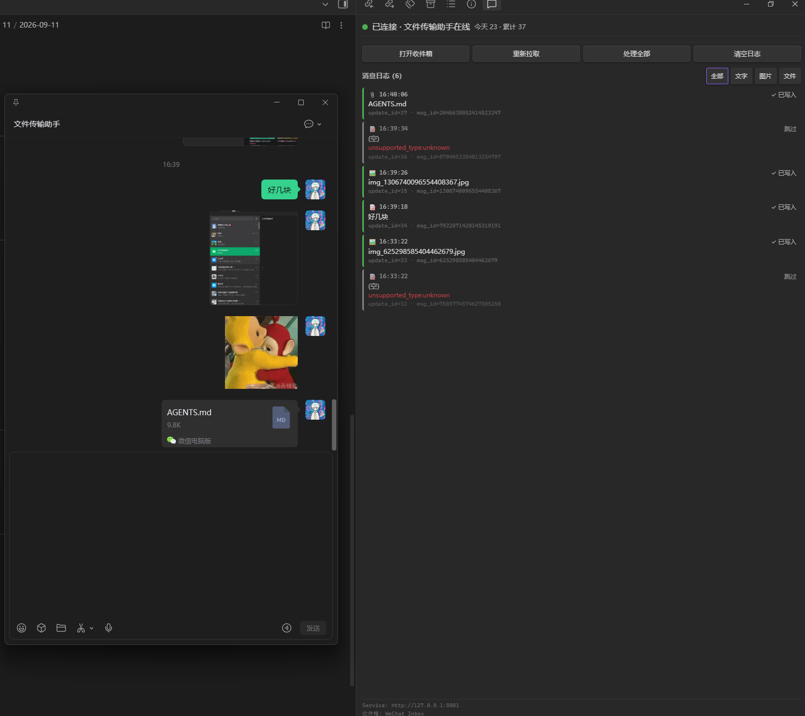
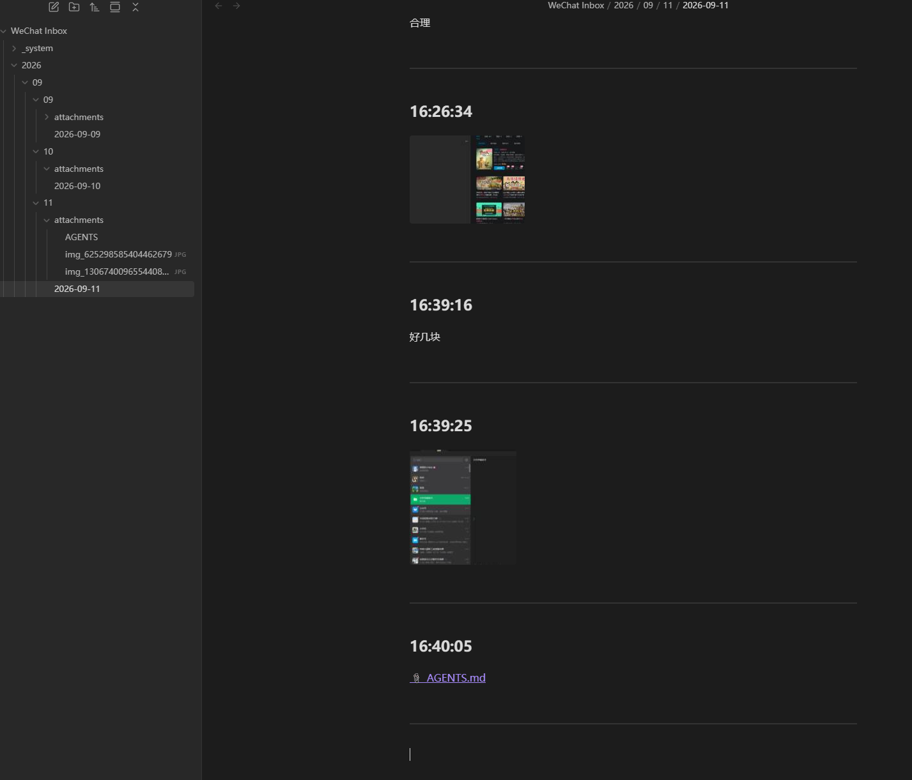

<div align="center">
  

  <h1>WeChat Inbox（微信收件箱）</h1>

  <p>
    <strong>把微信「文件传输助手」变成一个本地优先的 Obsidian 知识收件箱。</strong>
  </p>

  <p>
    把微信里随手发来的文字、图片、文件捕获成每日 Markdown 笔记与附件目录，
    让临时消息沉淀为可检索、可整理、可复用的知识。
  </p>

  <p>
    
    
    
    
  </p>

  <p align="center">
    <a href="../README.md"></a>
    <a href="README.md"></a>
  </p>
</div>

---

> [!IMPORTANT]
> 本插件必须配合 **Weave** 服务端使用：
> <https://github.com/LijiangTn/Weave>
>
> 安装本插件后，你还需要下载并启动 Weave 服务端，插件才能获取二维码、同步消息和下载附件。

---

## Preview

<div align="center">
  
  
</div>

<div align="center">
  插件侧栏预览：二维码登录、连接状态、消息日志与收件箱操作。
</div>

---

## Why this exists

很多人会把临时资料先发到微信「文件传输助手」里，但这些内容通常停留在聊天记录中：

- 不容易归档
- 不方便检索
- 难以进入长期的知识整理流程
- 手动复制到笔记系统的成本很高

`WeChat Inbox` 的目标，就是把这条高频但零散的输入路径，变成一个稳定的 Obsidian 收件箱入口。

---

## Overview

`WeChat Inbox` 是一个 Obsidian 社区插件，用来把微信「文件传输助手」中的内容同步到你的知识库。

它聚焦于三件事：

- 在 Obsidian 中提供清晰的收件箱视图、命令和设置
- 从本地同步服务 Weave 拉取消息并完成去重、分类、状态记录
- 将文本、图片和文件沉淀为按天组织的 Markdown 与附件目录

插件本身不处理微信协议，也不直接与微信服务器通信。它的职责是作为 Obsidian 侧的收件箱客户端，把已有的本地同步能力接入到知识管理流程中。

---

## Highlights

- **Local-first**: 数据默认保留在本机 Vault 与本地同步服务中
- **Daily capture**: 按天写入 `YYYY-MM-DD.md`，让收件箱天然可归档
- **Multiple content types**: 支持文本、图片与通用文件
- **Idempotent processing**: 基于 `message_id` 与 `lastUpdateId` 进行双层去重
- **Readable index**: 自动维护一份人类可读的 `message-index.md`
- **Automation-friendly**: 通过 `app.plugins.plugins["wechat-inbox"].api` 暴露稳定查询接口

---

## What it does not do

为避免定位模糊，这个插件不负责以下事项：

- 不解析微信协议
- 不模拟或接管微信客户端行为
- 不上传数据到云端
- 不执行远程脚本
- Phase 1 不内置 AI 处理能力

---

## How it works

整体链路如下：

1. 本地同步服务负责登录、消息拉取与文件获取。
2. `WeChat Inbox` 插件定时调用本地 HTTP 接口。
3. 插件对消息进行去重、分类、错误处理与状态记录。
4. 文本写入每日 Markdown，附件写入日期目录下的附件文件夹。
5. 插件维护消息索引与运行时状态，保证重启后仍可恢复处理进度。

默认目录结构示例：

```text
WeChat Inbox/
├── 2026/
│   └── 09/
│       └── 09/
│           ├── 2026-09-09.md
│           └── attachments/
│               ├── FastAPI最佳实践.pdf
│               └── img_6695653967305283517.jpg
└── _system/
    └── message-index.md
```

---

## Privacy and security

本项目默认采用本地处理模式：

- 不上传微信消息、文件或账号信息
- 不向第三方服务发送 Vault 内容
- 不引入远程代码执行
- 所有持久化数据仅保存在 Vault 和插件本地数据文件中

你仍然需要自行确保本地同步服务的部署方式、端口暴露范围，以及 Vault 所在设备本身的安全性。

---

## Requirements

- Obsidian `1.7.2` 或更高版本
- 一个可用的本地同步服务：[`Weave`](https://github.com/LijiangTn/Weave)
- 默认连接地址：`http://127.0.0.1:8081`
- Node.js 18+（仅在从源码构建时需要）

### Server dependency

本插件不是独立的微信协议实现，需要与 `Weave` 配合使用：

- GitHub: <https://github.com/LijiangTn/Weave>
- 默认服务地址：`http://127.0.0.1:8081`

建议使用顺序：

1. 下载并启动 `Weave`
2. 确认 `http://127.0.0.1:8081/api/v1/health` 可访问
3. 再打开 Obsidian 插件并开始扫码登录

---

## Installation

### Manual install

1. 在目标 Vault 下创建目录 `.obsidian/plugins/wechat-inbox/`
2. 从 [Releases](../../releases) 下载以下文件：
   - `main.js`
   - `manifest.json`
   - `styles.css`
3. 将它们放入 `.obsidian/plugins/wechat-inbox/`
4. 打开 Obsidian，进入 **Settings → Community plugins**
5. 启用 **WeChat Inbox**

### Install with BRAT

1. 安装 [BRAT](https://github.com/TfTHacker/obsidian42-brat)
2. 在 BRAT 中添加当前仓库
3. 由 BRAT 安装和更新插件

### Build from source

```bash
git clone <this-repo>
cd obsidian-wechat-inbox
npm install
npm run build
```

构建完成后，将 `main.js`、`manifest.json`、`styles.css` 复制到：

```text
<vault>/.obsidian/plugins/wechat-inbox/
```

---

## Configuration

在 Obsidian 中打开 **Settings → WeChat Inbox**：

| 设置项 | 默认值 | 说明 |
|---|---|---|
| Worker 地址 | `http://127.0.0.1:8081` | 本地同步服务 [Weave](https://github.com/LijiangTn/Weave) 的 HTTP 地址 |
| 知识库目录 | `WeChat Inbox` | Vault 内收件箱根目录 |
| 附件目录 | `attachments` | 当日目录下的附件子目录名 |
| 按日期分层 | `ON` | 以 `年/月/日` 组织目录 |
| 自动写入 Markdown | `ON` | 关闭后仅推进 offset，不写入 Vault |
| 启动 Obsidian 时自动连接 | `ON` | 插件加载完成后立即开始轮询 |
| 轮询间隔（毫秒） | `2000` | 拉取消息的间隔，最低 `500` |

设置变更会即时作用于运行中的插件实例。例如，连接地址变更后会立刻切换到新的目标地址。

---

## Usage

1. 点击左侧 Ribbon 的消息图标，或通过命令面板执行 **打开微信收件箱**
2. 如果 `Weave` 尚未启动，先按 UI 底部提示打开 GitHub 地址并启动服务端
3. 右侧栏会显示二维码
4. 使用手机微信扫码，并在手机上确认登录
5. 状态切换为“已连接”后，发送到「文件传输助手」的内容会自动同步

---

## View and commands

### Sidebar view

右侧栏会展示：

- 当前连接状态
- 今天 / 累计消息数
- 最近消息日志
- 最近错误信息
- 当前连接地址与收件箱目录
- 常用操作按钮，例如刷新二维码、重新拉取、打开收件箱目录

### Command palette

| 命令 | 说明 |
|---|---|
| 打开微信收件箱 | 打开或聚焦右侧收件箱视图 |
| 刷新微信二维码 | 立即重新获取登录二维码 |
| 重新拉取消息 | 重置同步游标，重新从本地服务拉取未处理更新 |
| 处理全部消息（清空已处理列表） | 清空去重记录并从头处理消息，适合排障或重建 |

---

## Data layout

插件运行后，会在 Vault 与插件数据目录中维护三类数据：

```text
<vault>/
├── WeChat Inbox/
│   ├── 2026/
│   │   └── 09/
│   │       └── 09/
│   │           ├── 2026-09-09.md
│   │           └── attachments/
│   └── _system/
│       └── message-index.md
└── .obsidian/plugins/wechat-inbox/
    └── data.json
```

说明如下：

- `YYYY-MM-DD.md`：当天消息正文，适合阅读和后续知识处理
- `message-index.md`：人类可读消息索引，包含 `msg_id`、`update_id`、日期文件引用
- `data.json`：插件运行时状态，包括 `processedMessageIds` 与 `lastUpdateId`

为保持每日文件干净，`msg_id` 与 `update_id` 不会写入当天正文文件本身。

---

## Public API

插件会在 `app.plugins.plugins["wechat-inbox"].api` 上暴露公共接口：

```ts
const plugin = app.plugins.plugins["wechat-inbox"];

const recent = plugin.api.getRecentMessages(50);
const indexPath = plugin.api.getMessageIndexPath();
const inboxFolder = plugin.api.getInboxFolder();
const status = plugin.api.getConnectionStatus();
```

返回能力包括：

- 最近消息列表
- 消息索引文件路径
- 当前收件箱根目录
- 当前连接状态

完整类型定义见 `src/api.ts`。

---

## FAQ

### 二维码显示正常，但始终无法登录

- 确认 [Weave](https://github.com/LijiangTn/Weave) 正在运行
- 检查设置中的连接地址是否正确
- 确认手机端已在扫码后点击“登录”

如果你使用的是默认本地接口实现，可以先测试状态接口：

```bash
curl http://127.0.0.1:8081/api/v1/wechat/login/status
```

### 视图显示已连接，但 Vault 中没有写入内容

- 确认 **自动写入 Markdown** 处于开启状态
- 检查 [Weave](https://github.com/LijiangTn/Weave) 是否已经收到消息
- 打开 Obsidian 开发者工具查看错误日志

```bash
curl "http://127.0.0.1:8081/api/v1/messages?source=wechat&page=1&size=5"
```

### 重启 Obsidian 后怀疑出现重复导入

正常情况下不会重复，因为插件会持久化：

- `processedMessageIds`
- `lastUpdateId`

如果你手动执行了“处理全部消息（清空已处理列表）”，则插件会重新处理历史消息，这是预期行为。

---

## Development

### Local development

```bash
npm install
npm run dev
```

### Production build

```bash
npm run build
```

### Lint

```bash
npm run lint
```

### Project structure

```text
src/
├── main.ts
├── constants.ts
├── types.ts
├── logger.ts
├── client.ts
├── settings.ts
├── api.ts
├── worker-errors.ts
├── plugin/
│   ├── state.ts
│   └── polling.ts
├── services/
│   ├── derive-phase.ts
│   ├── VaultWriter.ts
│   └── MessageService.ts
└── view/
    ├── InboxView.ts
    └── render.ts
```

---

## License

本项目基于 [MIT License](LICENSE) 发布。

---

## Acknowledgements

- Obsidian 团队：提供插件 API 与社区生态
- `obsidian-sample-plugin`：项目骨架的起点
